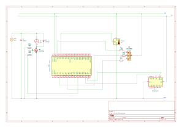

# STM32F407G-DISC1 Temperature-Based DC Fan Controller

This project implements a temperature-based DC fan control system using the STM32F407G-DISC1 development board.

The system reads temperature data from a DHT11 sensor and controls a DC fan using PWM. It also provides visual feedback using an RGB LED, displays real-time system status on a 16x2 I2C LCD, and activates a buzzer alarm when the temperature exceeds the defined threshold.

## Circuit Diagram



## Repository Structure

```text
Core/                  Bare-metal application source files
Drivers/               Bare-metal project driver files
HAL_Version/           HAL-based implementation
images/                Circuit diagram and project images
README.md              Project documentation
```

## Project Versions

This repository includes two implementation versions of the temperature-based fan controller:

| Version | Description |
|---|---|
| Bare-metal version | Uses direct register access without HAL functions in the application logic. |
| HAL version | Uses STM32 HAL library functions for peripheral initialization and control. |

## Target Board

- STM32F407G-DISC1
- MCU: STM32F407VGT6
- ARM Cortex-M4

## Features

- Temperature measurement using DHT11 sensor
- DC fan speed control using PWM
- Four temperature-based operating zones
- RGB LED zone indication
- Buzzer alarm for high temperature
- 16x2 I2C LCD display
- ITM/SWO CSV data logging
- Bare-metal C implementation using direct register access

## Hardware Components

- STM32F407G-DISC1 development board
- DHT11 temperature sensor
- DC fan
- N-channel MOSFET fan driver
- RGB LED
- Passive buzzer
- 16x2 LCD with PCF8574 I2C backpack
- External power supply for the fan
- Resistors and jumper wires

## Pin Configuration

| Function | STM32 Pin | Description |
|---|---|---|
| DHT11 Data | PA1 | Temperature sensor data pin |
| Fan PWM | PB10 | TIM2_CH3 PWM output for MOSFET gate control |
| Buzzer | PB11 | GPIO output |
| LCD SCL | PB6 | I2C1_SCL |
| LCD SDA | PB9 | I2C1_SDA |
| RGB Red | PC1 | Common-anode RGB LED, active LOW |
| RGB Green | PC2 | Common-anode RGB LED, active LOW |
| RGB Blue | PC4 | Common-anode RGB LED, active LOW |
| SWO / ITM | PB3 | CSV data logging |

## Temperature Control Logic

| Zone | Temperature Range | Fan Duty | RGB LED |
|---|---|---|---|
| Cool | < 20°C | 0% | Blue |
| Moderate | 20°C - 25.9°C | 35% | Green |
| Warm | 26°C - 27.9°C | 70% | Yellow |
| Hot | >= 28°C | 100% | Red |

Alarm threshold: 28°C

## Software and Tools

- STM32CubeIDE
- Bare-metal C
- STM32 HAL Library
- CMSIS register-level programming
- UART / ITM-SWO data logging
- KiCad / schematic design tool for circuit documentation

## Bare-Metal Implementation

The application logic is written using direct register access. HAL functions are not used in the main application code. STM32CubeIDE is used for project setup, startup files, linker script, and device configuration reference.

Main peripherals used in the project:

- GPIO
- TIM2 PWM
- TIM3 interrupt-based buzzer control
- I2C1 LCD communication
- DWT delay
- ITM/SWO logging

## HAL Implementation

The HAL version implements the same temperature-based fan control logic using STM32 HAL library functions. Peripheral initialization and control are handled through HAL-based functions generated and configured in STM32CubeIDE.

Main peripherals used in the HAL version:

- GPIO
- TIM2 PWM
- TIM3 interrupt-based buzzer control
- TIM4 microsecond delay timer
- I2C1 LCD communication
- USART2 UART data logging

## How to Run

1. Open the project in STM32CubeIDE.
2. Build the project.
3. Connect the STM32F407G-DISC1 board.
4. Flash the firmware to the board.
5. Connect the external fan driver circuit and DHT11 sensor according to the pin configuration.
6. Observe temperature, fan duty cycle, alarm state, and RGB LED status.

## Important Notes

The DC fan must not be powered directly from an STM32 GPIO pin. An external power supply and a MOSFET driver circuit should be used.

The RGB LED is common-anode, so the LED channels are active LOW.

The current alarm threshold in the firmware is 28°C.

## Author

Ayten Adiyan

Emine Ceylin Özel
